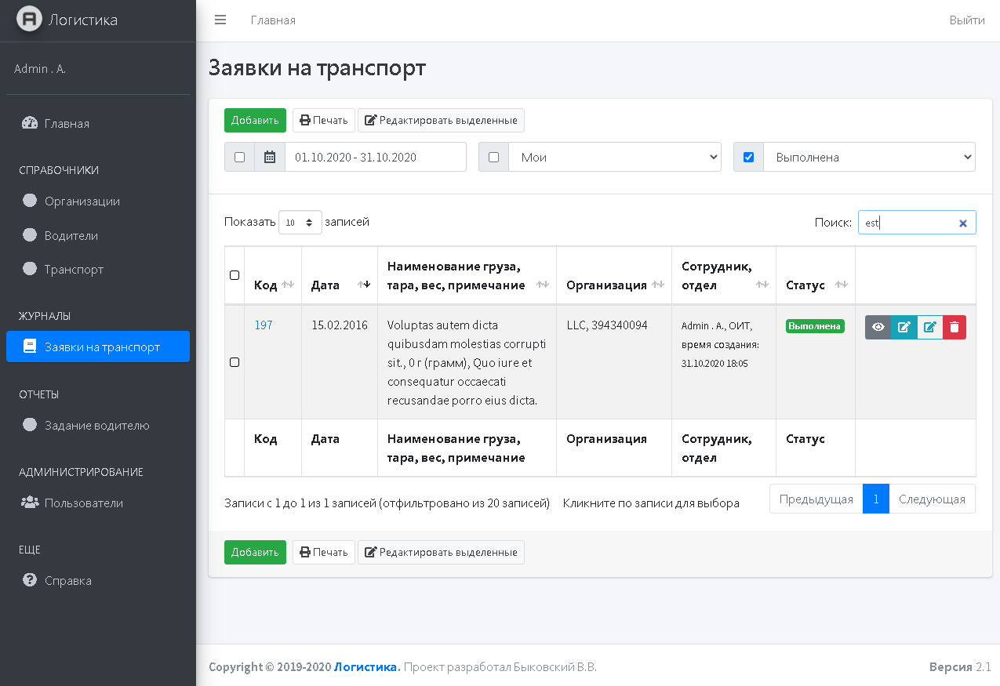

<p align="center"></p>

## About Project
The Symfony application is an application created for the logistics department that allows you to keep a log of transport requests and form a task for drivers.

## Requirements
  * PHP 7.2.9 or higher;
  * and the [usual Symfony application requirements][1].

## Quick Start
```shell
$ git clone https://github.com/vol-mir/logistic.git
$ cd logistic
$ composer install
$ cp .env.example .env
$ sh makedb.sh
$ sh makefixtures.sh
```

## Demo Credentials
**User:** admin  
**Password:** admin

## Screen


[1]: https://symfony.com/doc/current/reference/requirements.html